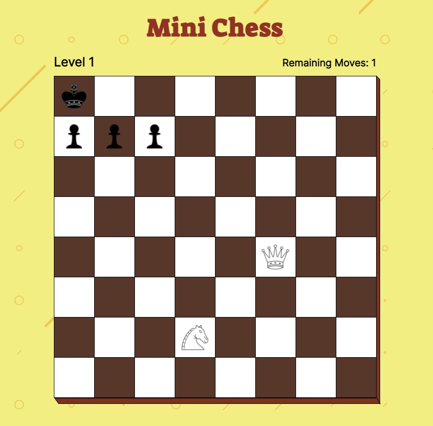

# MINI CHESS

## Test your ability in the ultimate challenge!

In Mini Chess You will face with a lot of situations to the test your skills in checkmating the enemy king

https://martinogarrizzo5.github.io/mini-chess/



## How to Use The Code

### Development

1. Ensure to have Node.js and npm installed
2. Install the dev dependencies

3. Add at the bottom of the index.html file the following script tags

```html
<script type="text/javascript" src="./scripts/grid-cell.js"></script>
<script type="text/javascript" src="./scripts/chess-piece.js"></script>
<script type="text/javascript" src="./scripts/pieces/king.js"></script>
<script type="text/javascript" src="./scripts/pieces/queen.js"></script>
<script type="text/javascript" src="./scripts/pieces/bishop.js"></script>
<script type="text/javascript" src="./scripts/pieces/knight.js"></script>
<script type="text/javascript" src="./scripts/pieces/pawn.js"></script>
<script type="text/javascript" src="./scripts/pieces/rook.js"></script>
<script type="text/javascript" src="./scripts/grid.js"></script>
<script type="text/javascript" src="./scripts/levels.js"></script>
<script type="text/javascript" src="./scripts/ui.js"></script>
<script type="text/javascript" src="./scripts/index.js"></script>
```

4. Open the index.html file in a browser

### Production

1. Execute the build command:

```
npm run build
```

2. Remove all scripts at the bottom of index.html

3. Add the built script at the bottom of index.html

```html
<script type="text/javascript" src="./index.js"></script>
```
